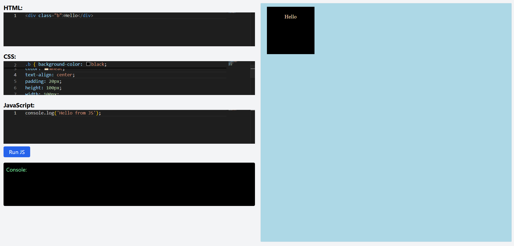

# Real-Time-Code-Design-Translator

**LiveWeaver** is a real-time HTML, CSS, and JavaScript editor with a built-in console and live design preview. It's designed to help developers experiment, debug, and visualize code instantly — all in the browser.

 

---

## 🚀 Features

- 🧠 **Real-time** HTML & CSS rendering
- 🧪 Manual **JavaScript execution** to avoid spammy reruns
- 📜 Integrated **console log viewer**
- 🧱 Built with React, Vite, Tailwind, and Monaco Editor
- ⚡ Fast dev server with hot reload

---

## 🛠️ Getting Started

### Installation

1. Clone the repo:
   ```bash
   git clone https://github.com/your-username/liveweaver.git
